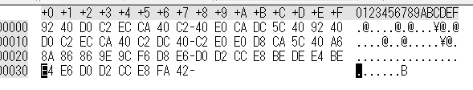

# [Programming-100pt] x2.txt

## Question

```plane
2倍になって文字化けしてしまったので、半分にしてみよう。
```

[x2.txt](x2.txt)

## Answer

バイナリエディタで開いてみた



おそらくASCIIコードを２倍にしたんだな～

スクリプトを書いてみる

[solve.py](solve.py)

```python
#!/usr/bin/env python3

d = open("x2.txt","rb").read()
print("".join([chr(c//2) for c in d]))
```

```plane
$ python solve.py
I have a pen. I have an apple. SECCON{lshift_or_rshift}!
```

流石に草

`SECCON{lshift_or_rshift}`
