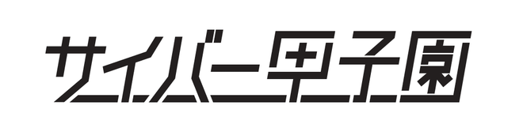
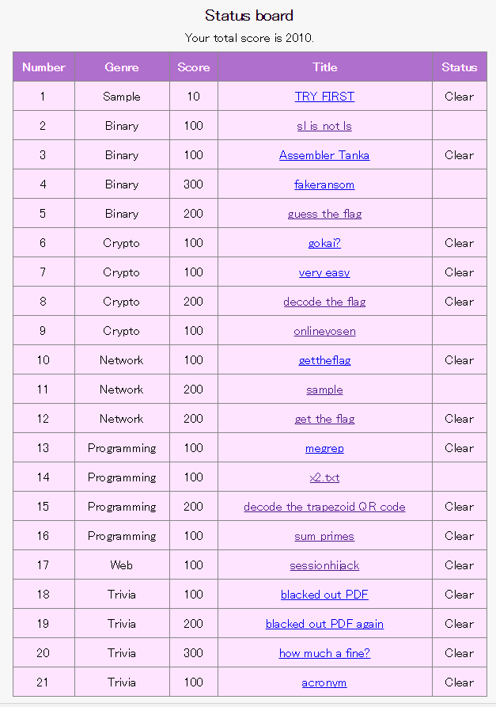

# サイバー甲子園(2016) -WriteUp-

>[https://akashisn.info/Cyber-Koshien-2016](https://akashisn.info/Cyber-Koshien-2016/)

`BiPhone`というチームで[@snow](https://twitter.com/Snow_Poijio)と一緒に出場した

結果４位だった

## WriteUp

|Id|Genre|Score|Title|Status|WriteUp|
|:-:|:----:|:----:|:----:|:-:|:-----:|
|00|Sample|10pt|[TRY FIRST](Sample/TRY_FIRST/README.md)|✓|✓|
|01|Binary|100pt|[sl is not ls](Binary/sl_is_not_ls/README.md)||✓|
|02|Binary|100pt|[Assembler Tanka](Binary/Assembler_Tanka/README.md)|✓|✓|
|03|Binary|300pt|[fakeransom](Binary/fakeransom/README.md)|||
|04|Binary|200pt|[guess the flag](Binary/guess_the_flag/README.md)||✓|
|05|Crypto|100pt|[gokai?](Crypto/gokai/README.md)|✓|✓|
|06|Crypto|100pt|[very easy](Crypto/very_easy/README.md)|✓|✓|
|07|Crypto|200pt|[decode the flag](Crypto/decode_the_flag/README.md)|✓|✓|
|08|Crypto|100pt|[onlineyosen](Crypto/onlineyosen/README.md)||✓|
|09|Network|100pt|[gettheflag](Network/gettheflag/README.md)|✓|✓|
|10|Network|200pt|[sample](Network/sample/README.md)||✓|
|11|Network|200pt|[get the flag](Network/get_the_flag/README.md)|✓|✓|
|12|Programming|100pt|[megrep](Programming/megrep/README.md)|✓|✓|
|13|Programming|100pt|[x2.txt](Programming/x2.txt/README.md)||✓|
|14|Programming|200pt|[decode the trapezoid QR code](Programming/decode_the_trapezoid_QR_code/README.md)|✓|✓|
|15|Programming|100pt|[sum primes](Programming/sum_primes/README.md)|✓|✓|
|16|Web|100pt|[sessionhijack](Web/sessionhijack/q17.md)|✓|✓|
|17|Trivia|100pt|[blacked out PDF](Trivia/blacked_out_PDF/README.md)|✓|✓|
|18|Trivia|200pt|[blacked out PDF again](Trivia/blacked_out_PDF_again/README.md)|✓|✓|
|19|Trivia|300pt|[how much a fine?](Trivia/how_much_a_fine/README.md)|✓|✓|
|20|Trivia|100pt|[acronym](Trivia/acronym/README.md)|✓|✓|

